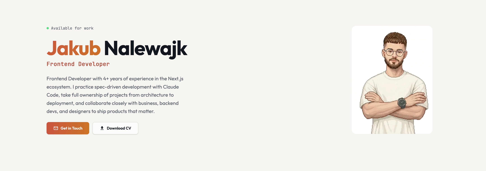

# Portfolio — Jakub Nalewajk

> Multilingual frontend developer portfolio with an MDX blog, i18n (Polish + English), reCAPTCHA-protected contact form, and React 19 islands. Static-first with Astro 5, self-hosted on VPS with Dokploy.

**[Live Demo](https://jnalewajk.me)** | **[Status Page](https://status.jnalewajk.me)**



### Lighthouse Scores

| Performance | Accessibility | Best Practices | SEO |
|:-----------:|:------------:|:--------------:|:---:|
| 98 | 100 | 100 | 100 |

---

## What it does

- **Portfolio sections** — hero with animated avatar, experience timeline, project showcase with live demos, services offering, categorized skills grid, and a working contact form
- **Multilingual** — full Polish + English support with locale-aware routing, translation validation at build time, browser language detection, and language switcher
- **Blog system** — MDX-powered posts with pagination, tag filtering, table of contents with active heading tracking, share links, and translated post linking
- **SEO** — JSON-LD structured data (Person, ProfessionalService, BlogPosting, BreadcrumbList), hreflang tags, canonical URLs, Open Graph, sitemap with i18n
- **Contact form** — client-side reCAPTCHA v3 verification, React Email template rendering, server-side Resend delivery, and confetti animation on success
- **Theme system** — dark/light toggle with OKLCH color tokens, persistent preference, and smooth transitions

## Architecture

```
src/
├── components/
│   ├── atoms/                # Basic UI elements (Badge, Card, IconBox, Heading, etc.)
│   ├── molecules/            # Composed elements (BlogCard, LanguageSwitcher, Pagination)
│   ├── organisms/            # Full sections (Home, Experience, Projects, Services, Skills, Contact)
│   └── react/                # Interactive React islands (ContactForm, form inputs)
├── content/posts/
│   ├── en/                   # English blog posts (MDX)
│   └── pl/                   # Polish blog posts (MDX)
├── emails/                   # React Email templates (ContactFormEmail)
├── hooks/                    # React hooks (useCaptcha)
├── i18n/
│   ├── config.ts             # Locales, defaults, BCP47/OG mappings
│   ├── utils.ts              # getLocale, t(), getLocalizedPathname, formatDate
│   └── translations/         # pl.ts, en.ts — all UI strings
├── layouts/                  # Page layouts (Layout, MarkdownPostLayout)
├── pages/
│   ├── [...locale]/          # Locale-aware routes (/ for PL, /en/ for EN)
│   │   ├── blog/             # Paginated blog + individual posts
│   │   └── category/         # Tag-filtered blog
│   └── api/                  # SSR endpoints: reCAPTCHA, email
├── scripts/                  # Client-side utils (locale-detect, scroll-animations, code-copy)
├── styles/                   # Tailwind v4 CSS-based config with OKLCH design tokens
└── utils/                    # Shared helpers (cn, posts, seo, date, error, responses)
```

Components follow **Atomic Design** — atoms are primitive UI elements, molecules compose atoms, organisms compose molecules into full page sections. Each level has a barrel `index.ts` for clean imports.

## Key technical decisions

- **Astro 5 with React 19 islands** — static generation for all content pages, selective hydration (`client:load`) only for the contact form to minimize client-side JavaScript
- **Custom i18n without external libraries** — `[...locale]` rest params for routing, TypeScript translation objects with `as const` for type safety, `translationKey` field for linking translated blog posts, ~200 lines of utility code
- **Tailwind CSS v4 with CSS-based config** — no `tailwind.config` file; all design tokens defined as CSS custom properties in OKLCH color space with `@custom-variant` for dark mode
- **Content Collections with MDX** — type-safe blog posts with Zod schema validation, `lang` enum derived from `LOCALES` config, build-time translation validation (structure, fields, completeness)
- **Structured data for local SEO** — Person + ProfessionalService + GeoCoordinates schemas, BreadcrumbList on blog pages, hreflang in both HTML and sitemap

## Tech stack

| Layer | Technology |
|---|---|
| Framework | Astro 5 (SSG + SSR for API routes) |
| Language | TypeScript (strict) |
| UI | React 19, Tailwind CSS 4, Astro components |
| Content | MDX, Astro Content Collections, Zod |
| i18n | Custom (no external library) |
| Email | React Email + Resend |
| Security | Google reCAPTCHA v3 |
| Linting | Biome |
| Deployment | Node.js standalone, Docker, Dokploy/Traefik on VPS |

## Getting started

```bash
git clone https://github.com/jaqubowsky/portfolio.git
cd portfolio
npm install
cp .env.example .env      # fill in required values
npm run dev                # start dev server at localhost:4321
```

Requires Node.js 18+.
